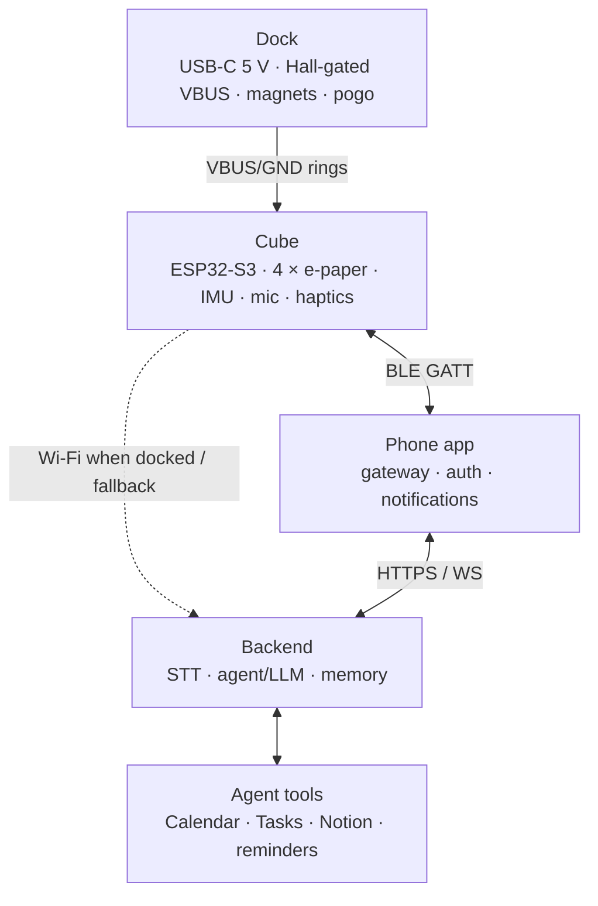
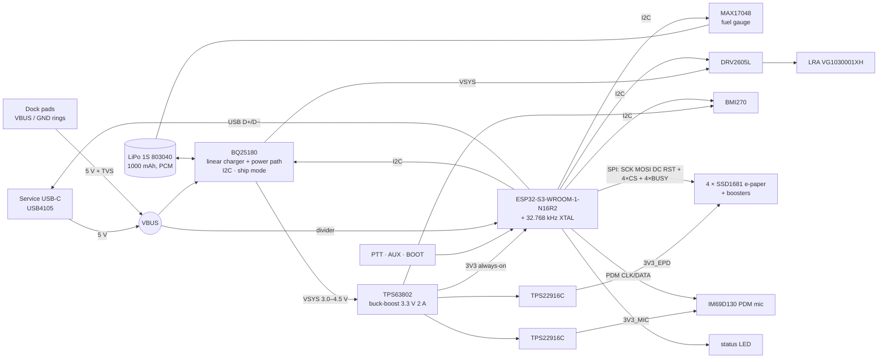
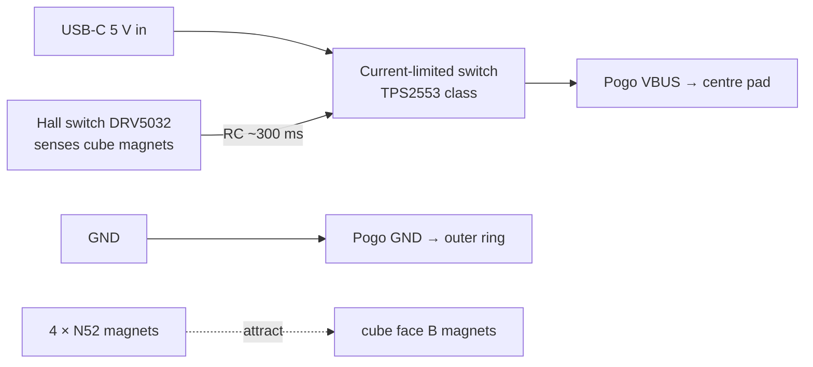

# Block diagrams (Phase B, proposed)

## 1. System

```mermaid
flowchart TB
  Cube[Cube<br/>ESP32-S3 · 4 × e-paper · IMU · mic · haptics] <-->|BLE GATT| Phone[Phone app<br/>gateway · auth · notifications]
  Cube -. Wi-Fi when docked / fallback .-> Backend
  Phone <-->|HTTPS / WS| Backend[Backend<br/>STT · agent/LLM · memory]
  Backend <--> Tools[Agent tools<br/>Calendar · Tasks · Notion · reminders]
  Dock[Dock<br/>USB-C 5 V · Hall-gated VBUS · magnets · pogo] -->|VBUS/GND rings| Cube
```

## 2. Electronics + power

```mermaid
flowchart LR
  USBC[Service USB-C<br/>USB4105] -->|5 V| OR((VBUS))
  DOCK[Dock pads<br/>VBUS / GND rings] -->|5 V + TVS| OR
  OR --> CHG[BQ25180<br/>linear charger + power path<br/>I2C · ship mode]
  BAT[(LiPo 1S 803040<br/>1000 mAh, PCM)] <--> CHG
  BAT --- FG[MAX17048<br/>fuel gauge]
  CHG -->|VSYS 3.0–4.5 V| BB[TPS63802<br/>buck-boost 3.3 V 2 A]
  CHG -->|VSYS| HD[DRV2605L] --> LRA[LRA VG1030001XH]
  BB -->|3V3 always-on| MCU[ESP32-S3-WROOM-1-N16R2<br/>+ 32.768 kHz XTAL]
  BB --> IMU[BMI270]
  BB --> LS1[TPS22916C] -->|3V3_EPD| EPD[4 × SSD1681 e-paper<br/>+ boosters]
  BB --> LS2[TPS22916C] -->|3V3_MIC| MIC[IM69D130 PDM mic]
  MCU -- SPI: SCK MOSI DC RST + 4×CS + 4×BUSY --> EPD
  MCU -- I2C --> IMU & HD & FG & CHG
  MCU -- PDM CLK/DATA --> MIC
  MCU -- USB D+/D− --> USBC
  KEYS[PTT · AUX · BOOT] --> MCU
  OR -->|divider| MCU
  MCU --> LED[status LED]
```

## 3. Dock

```mermaid
flowchart LR
  U[USB-C 5 V in] --> SW[Current-limited switch<br/>TPS2553 class]
  HALL[Hall switch DRV5032<br/>senses cube magnets] -->|RC ~300 ms| SW
  SW --> P1[Pogo VBUS → centre pad]
  G[GND] --> P2[Pogo GND → outer ring]
  M[4 × N52 magnets] -. attract .-> C[cube face B magnets]
```
